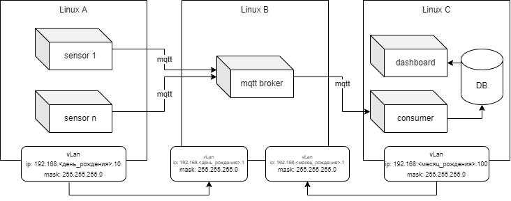

# Docker Practice — IoT Sensor Monitoring

Задание по облачным технологиям. Система мониторинга IoT-датчиков на Docker.

## Ветки репозитория

- `master` — только это README (задание)
- `develop` — полный код задания

## Быстрый старт

Смотри [report.md](report.md) — полная инструкция по развёртыванию.
