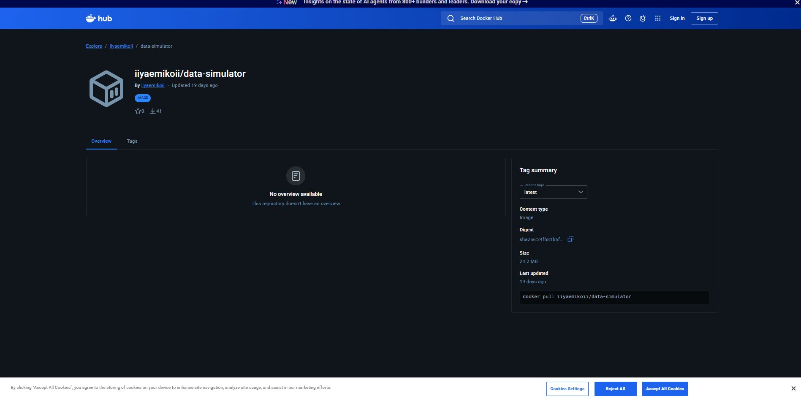
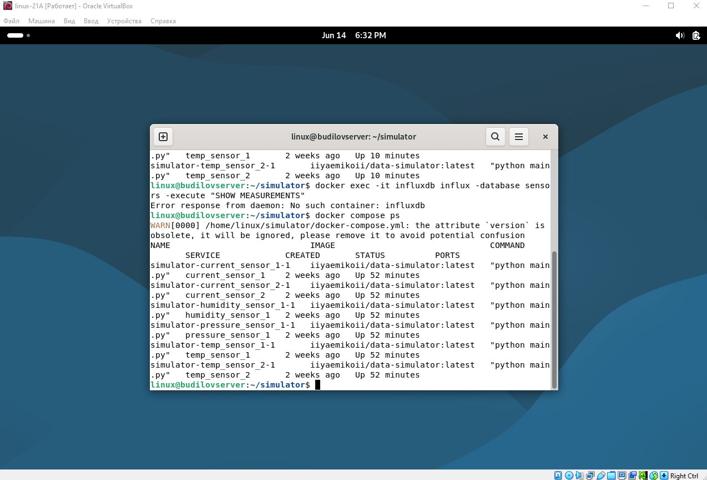
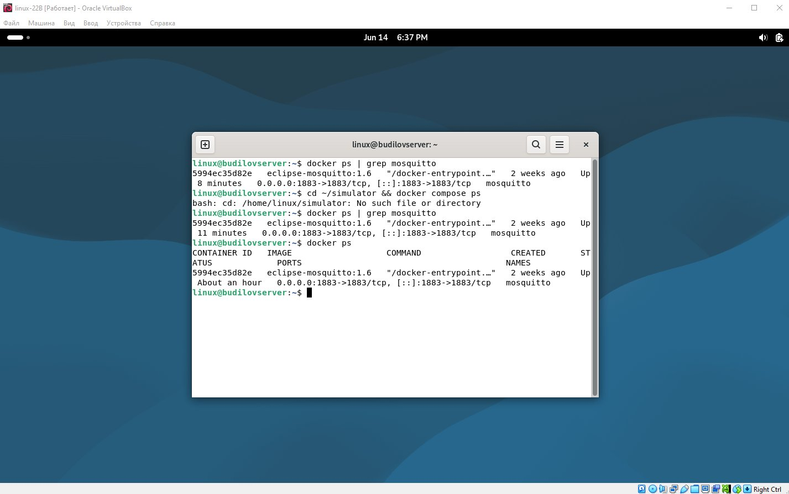
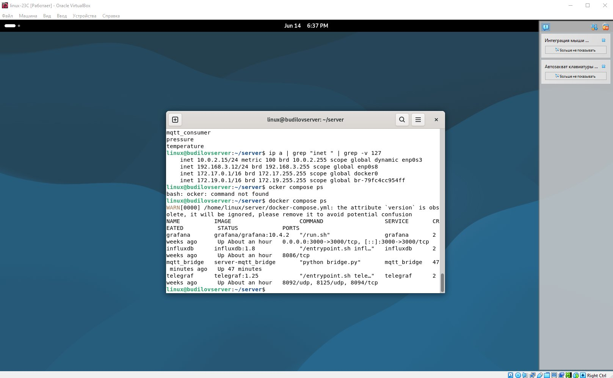

# Отчёт: Развёртывание IoT-системы мониторинга на Docker

## Архитектура системы

```
┌──────────────────────┐   MQTT (1883)   ┌──────────────────┐   HTTP (8086)   ┌──────────────────────┐
│   Linux A            │ ──────────────► │   Linux B         │ ◄────────────── │   Linux C            │
│   192.168.3.11       │                 │   192.168.3.10    │                 │   192.168.3.12       │
│                      │                 │                   │  подписка       │                      │
│  6 симуляторов:      │                 │  Mosquitto 1.6    │  sensors/#      │  mqtt_bridge         │
│  • temp_boiler       │                 │  MQTT Broker      │                 │  InfluxDB 1.8        │
│  • temp_ambient      │                 │                   │                 │  Grafana             │
│  • press_main_line   │                 │                   │                 │  (порт 3000)         │
│  • current_motor_a   │                 │                   │                 │                      │
│  • current_motor_b   │                 │                   │                 │                      │
│  • hum_warehouse     │                 │                   │                 │                      │
└──────────────────────┘                 └───────────────────┘                 └──────────────────────┘
```

---

## Типы датчиков

| Класс | Тип | Единица | Формула генерации |
|-------|-----|---------|-------------------|
| `Temperature` | temperature | °C | `BASE + sin(step/10) * BIRTH_MONTH * 0.3 + шум` |
| `Pressure` | pressure | hPa | `BASE + cos(step/15) * 5 + (BIRTH_YEAR % 100)/50 * шум` |
| `Current` | current | А | `|sin(step*π/(BIRTH_MONTH*3))| * 10 + шум` |
| `Humidity` | humidity | % | `BASE + cos(step/20) * (BIRTH_YEAR%10+5) + шум` |

В формулах используется дата рождения (`BIRTH_YEAR`, `BIRTH_MONTH`) как коэффициент.

---

## Linux A — Симуляторы датчиков

### Структура

```
vms/client/simulator/
├── Dockerfile
├── docker-compose.yml
├── main.py
├── requirements.txt
└── entity/
    ├── __init__.py
    └── sensor.py
```

### Переменные среды

| Переменная | Описание | Пример |
|------------|----------|--------|
| `SIM_HOST` | IP MQTT-брокера | `192.168.3.10` |
| `SIM_PORT` | Порт брокера | `1883` |
| `SIM_TYPE` | Тип датчика | `temperature` |
| `SIM_NAME` | Имя датчика | `temp_boiler` |
| `SIM_PERIOD` | Период публикации (сек) | `5` |
| `SIM_TOPIC_FORMAT` | Формат: `value` или `json` | `value` |

### Образ на DockerHub

```bash
docker pull iiyaemikoii/data-simulator:latest
```



### Запущенные контейнеры



---

## Linux B — MQTT Брокер Mosquitto

### Конфигурация

Файл `vms/gateway/mosquitto/mosquitto.conf` подключается через volume.

### Запуск

```bash
cd vms/gateway/mosquitto
chmod +x start.sh
./start.sh
```

Или вручную:

```bash
# Открыть порт
sudo ufw allow 1883/tcp

# Запустить контейнер
docker run -d \
  --name mosquitto \
  --restart unless-stopped \
  -p 1883:1883 \
  -v $(pwd)/mosquitto.conf:/mosquitto/config/mosquitto.conf:ro \
  eclipse-mosquitto:1.6
```

### Проверка

```bash
docker exec mosquitto mosquitto_sub -h localhost -t "sensors/#" -v
```



---

## Linux C — Сервер (InfluxDB + mqtt_bridge + Grafana)

### Состав сервисов

| Сервис | Образ | Назначение |
|--------|-------|-----------|
| `influxdb` | influxdb:1.8 | БД временных рядов |
| `telegraf` | telegraf:1.25 | Конфиг в наличии (резервный) |
| `mqtt_bridge` | собственный образ | Подписка MQTT → запись в InfluxDB |
| `grafana` | grafana/grafana | Визуализация |

> **Примечание:** Вместо telegraf используется `mqtt_bridge` — собственный Python-сервис
> (paho-mqtt + influxdb-python). Telegraf 1.25 возвращал `network Error: EOF` при
> подключении к mosquitto 1.6 на Debian 13. mqtt_bridge реализует ту же функциональность:
> подписку на `sensors/#` и запись метрик в InfluxDB с тегами `sensor` и `topic`.
> Конфигурационные файлы telegraf сохранены в репозитории.

### Volumes

- `influx_data` — данные InfluxDB (именованный volume)
- `grafana_data` — данные Grafana, включая дашборды (именованный volume)
- `./influxdb/scripts` — скрипт инициализации БД
- `./telegraf` — конфиг telegraf
- `./grafana/` — конфиги и провизионирование Grafana

### Алиасы контейнеров

В конфигурационных файлах используются алиасы, а не IP:
- `http://influxdb:8086` — адрес InfluxDB (из mqtt_bridge и Grafana datasource)
- Все сервисы в одной сети `server-net`

### Запуск

```bash
# Настроить сеть
sudo ip addr add 192.168.3.12/24 dev enp0s8
sudo ip link set enp0s8 up

cd vms/server

# Подставить IP Linux B в конфиги
sed -i 's/192.168.3.10/ВАШ_IP_LINUX_B/g' docker-compose.yml
sed -i 's/192.168.3.10/ВАШ_IP_LINUX_B/g' telegraf/telegraf.conf

docker compose up -d
```

### Проверка InfluxDB

```bash
docker exec -it influxdb influx -execute "SHOW DATABASES"
# Должна появиться база sensors

docker exec -it influxdb influx -database sensors \
  -execute "SELECT * FROM mqtt_consumer LIMIT 5"
```

### Контейнеры Linux C



---

## Grafana Dashboard

Дашборд **IoT Sensor Dashboard** провизионируется автоматически из файла
`grafana/provisioning/dashboards/sensors.json` и отображает:

- Текущие значения температуры (2 датчика)
- Текущие значения давления (1 датчик)
- Текущие значения тока (2 датчика)
- Текущие значения влажности (1 датчик)
- Среднее значение по всем датчикам (агрегат)

В VirtualBox для Linux C добавить Port Forwarding:
- Host Port: `3000` → Guest Port: `3000`

Открыть: http://127.0.0.1:3000 (admin / admin)


---

## Полная инструкция по запуску

### Требования

На каждой VM установить Docker:

```bash
sudo apt update && sudo apt install -y ca-certificates curl gnupg
sudo install -m 0755 -d /etc/apt/keyrings
curl -fsSL https://download.docker.com/linux/debian/gpg | \
  sudo gpg --dearmor -o /etc/apt/keyrings/docker.gpg
echo "deb [arch=$(dpkg --print-architecture) signed-by=/etc/apt/keyrings/docker.gpg] \
  https://download.docker.com/linux/debian bookworm stable" | \
  sudo tee /etc/apt/sources.list.d/docker.list > /dev/null
sudo apt update
sudo apt install -y docker-ce docker-ce-cli containerd.io docker-compose-plugin
sudo usermod -aG docker $USER && newgrp docker
```

### Шаг 1 — Linux B: MQTT брокер

```bash
# Настроить внутреннюю сеть (если DHCP не настроен)
sudo ip addr add 192.168.3.10/24 dev enp0s8
sudo ip link set enp0s8 up

# Сделать постоянным
sudo tee /etc/systemd/network/10-enp0s8.network << EOF
[Match]
Name=enp0s8
[Network]
Address=192.168.3.10/24
EOF
sudo systemctl enable systemd-networkd && sudo systemctl restart systemd-networkd

# Запустить Mosquitto
cd vms/gateway/mosquitto && ./start.sh
```

### Шаг 2 — Linux C: Сервер

```bash
sudo ip addr add 192.168.3.12/24 dev enp0s8
sudo ip link set enp0s8 up

cd vms/server
docker compose up -d
docker compose ps
```

### Шаг 3 — Linux A: Симуляторы

```bash
sudo ip addr add 192.168.3.11/24 dev enp0s8
sudo ip link set enp0s8 up

# Скачать образ с DockerHub
docker pull iiyaemikoii/data-simulator:latest

cd vms/client/simulator
docker compose up -d
docker compose ps
```

### Шаг 4 — Открыть Grafana

В VirtualBox добавить Port Forwarding для Linux C:
- Host Port `3000` → Guest Port `3000`

Открыть: `http://127.0.0.1:3000`
- Логин: `admin` / Пароль: `admin`
- Dashboards → **IoT Sensor Dashboard**

---

## Структура репозитория

```
root/
├── assets/images/          — скриншоты
├── vms/
│   ├── client/simulator/   — код симуляторов + Dockerfile
│   ├── gateway/mosquitto/  — конфиг mosquitto + start.sh
│   └── server/
│       ├── grafana/        — конфиги Grafana (provisioning)
│       ├── influxdb/       — скрипт инициализации БД
│       ├── telegraf/       — конфиг telegraf
│       ├── mqtt_bridge/    — Python-сервис приёма MQTT
│       └── docker-compose.yml
├── README.md
└── report.md
```
